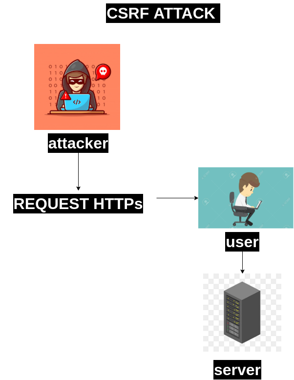

# CSRFAttackPractice
# **INDICE**
1. [Primer apartado](#id1)
2. [Segundo apartado](#id2)

# **1.INTRODUCCION**
    En la actualidad existen varios ataques cibernéticos hacia aplicaciones web que puede perjudicar a los usuarios que navegan por el internet por ello es recomendable que conozcan no todo sino lo suficiente para identificar cuando es posible o prevenir los ataques, por ello se hará una descripción del ataque CSRF y una práctica de como realizan los atacantes este tipo de ataque y recomendaciones de cómo prevenir tanto de parte del usuario del proveedor de la página web. 
# **2 CSRF ATTACK**
- ## **2.1 ¿Qué es un ataque CSRF?**
        El Cross Site Request Forgery (CSRF, Falsificación de solicitud de sitio de El Cross) es un tipo de ataque a sistemas o aplicaciones web comúnmente que se suele usar para estafas, robo de cuentas, o de información relevante por Internet. Los delincuentes realizan este ataque cuando se apoderan de una sesión autorizada por el usuario para realizar actos dañinos. El ataque se lleva a cabo mediante el protocolo HTTP. (ionos, 24)

- ## **2.2 ¿Cómo funciona un ataque CSRF?**
        Un usuario accede a una página o aplicación web iniciando sesión; y a la vez visita otras páginas, la cual fue implementadas por el atacante, en cual el usuario realiza diversas acciones, por ejemplo, el accionamiento de un botón, en la cual en esa acción el atacante envía una solicitud HTTP al portal empleado por el usuario y realiza una acción dentro del servidor en nombre del el, ya que la sesión esta activa. (ionos, 24)

        Para realizar este ataque el atacante debe de saber simplemente la forma de la solicitud HTTP correcta.

        Servidor del portal reconoce la solicitud HTTP que ha sido formulada correctamente y atreves de las cookies de sesión correspondientes, el servidor ejecuta las acciones del atacante en nombre del usuario sin que se dé cuenta.
- ## **2.3 ¿Por qué funciona el ataque CSRF?**
        El Ataque CSRF es un ataque que funciona porque un servidor (receptador) que procesa peticiones HTTP no puede o no comprueba de donde proceden dichas solicitudes HTTP, es decir, no queda claro si la petición fue hecha o creada por la propia página web o si fue de origen externo, en este contexto, el atacante puede aprovecharse de la brecha de seguridad del propio navegador o del propio navegador para trasmitir dichas solicitudes al servidor sin que se cuenta que un tercero está haciendo dicha acción. (ionos, 24)

- ## **2.4 Diagrama de representación del ataque**
    

- ## **2.5 Consecuencias del ataque CSRF**
    - Robo de identidad 
    - Robo de cuentas en páginas web
    - Robo de información sensible
    - Acciones no reversibles en una pagina
    - Robo de material valioso 

- ## **2.6 Medias de prevención para evitar un ataque CSRF de parte del usuario**
    - ### **2.6.1 Navegar con atención y precaución**
            En la actualidad existen varias sino bastante forma de acceder a cuentas sin autorización alguna, por ello es recomendable navegar en las páginas web con precaución y alerta, revisando la procedencia de la página, el contenido de dicha página, y a la vez tener cuidado de que información ingresa en páginas.

    - ### **2.6.2 Revisar el terminal en busca de malware**
            Aunque la mayoría de las personas no tienen concomiendo avanzado del uso de un navegador, sería recomendable que todos los usuarios de internet tengan el cocimiento de acceder a la terminal o consola de los navegadores para poder revisar cuando sospecha de una página, revisar las peticiones y ejecuciones de un script en consola para prevenir un ataque CSRF o cualquier otro tipo de ataque hacia las paginas o hacia el propio usuario.
		
- ## **2.7 Métodos para bloquear un ataque CSRF de parte del servidor**
    - ### **2.7.1 Autenticación de doble factor**
            La mayoría de aplicaciones web en la actualidad se puede implementar una autenticación de doble factor, para poder realizar el acceso a la aplicación web o para realizar acciones importantes dentro de la aplicación web, como ejemplo en los bancos para realizar una transacción en un portal de banco solicita un token enviando al correo o al celular para poder realizar la transacción.
	
    - ## **2.7.2 Encabezado de referencia**
            La mayoría de navegadores en algunos casos no solicitan o no les dan importancia a los encabezados de referencia (host de origen, host de llegada, CORS) de las peticiones HTTP, por tal forma es posible realizar este tipo de ataque, por tal forma los servidores deberán de agregar obligatoriamente esta información en el encabezado para evitar los más posible estos tipos de ataques. 
    - ## **2.7.3 Cerrar sesión al finalizar el uso**
            La mayoría de ataques CSRF suceden porque en el servidor no tienen autenticación de token CSRF pero otro de los mayores vulnerabilidades sucede porque el servidor no tiene un tiempo límite de sesión, es decir que la sesión puede estar abierta por todo el tiempo, de tal forma eso hace más susceptible a los ataques, por ello se recomienda que en los servidores se tenga limite en las sesiones.
		
# **3 Practica con el software OWSAP (Open Web Application Security Project) y servidor creado.**

## Primer apartado
Texto del primer apartado
## Segundo apartado
Texto del segundo apartado